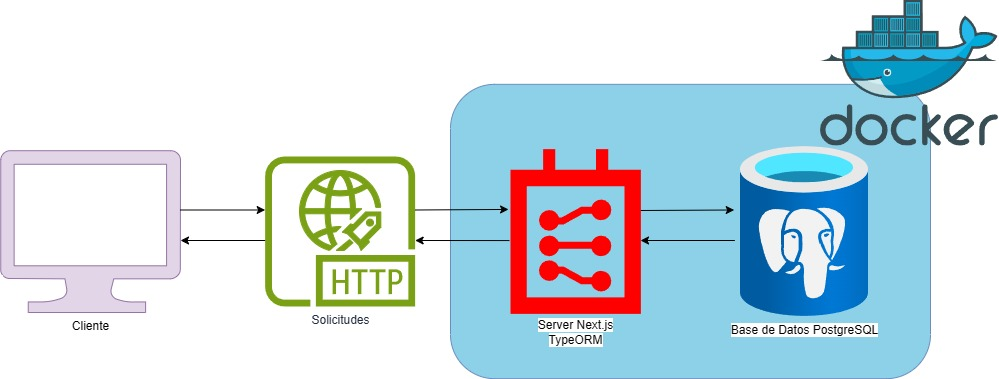

# News Challenge Backend

Backend de la aplicación de noticias con NestJS, PostgreSQL y Docker Compose.


## Ejecución

### Prerrequisitos

- Node.js ≥ 22
- Docker & Docker Compose (opcional pero recomendado)

### Modo desarrollo

```bash
npm install
npm run start:dev
````

### Modo producción

```bash
npm run build
npm run start:prod
```

### Con Docker Compose

```bash
# Levanta en modo desarrollo
npm run docker:dev

# Levanta en modo producción (recompila y arranca)
npm run compose:prod

# Detiene los contenedores
npm run docker:stop
```

## Diagrama de Arquitectura



## Arquitectura

El backend se despliega con **Docker Compose** y consta de dos servicios:

1. **API REST**

   * Servidor NestJS expuesto en el puerto **3000**.
   * Documentación Swagger en `GET /api`.
   * Endpoints:

     * `GET    /news`
     * `GET    /news/:id`
     * `POST   /news`
     * `PUT    /news/:id`
     * `DELETE /news/:id`
     * `GET    /news?term={title|author}`
   * **TypeORM** mapea la entidad `News` (`id`, `title`, `body`, `image_url`, `author`, `date`).

2. **db**

   * Contenedor **PostgreSQL** expuesto en el puerto **5432**.
   * Aloja la tabla `news` con los registros de noticias.

## Autor

Desarrollado por **Tomás Ribes**
